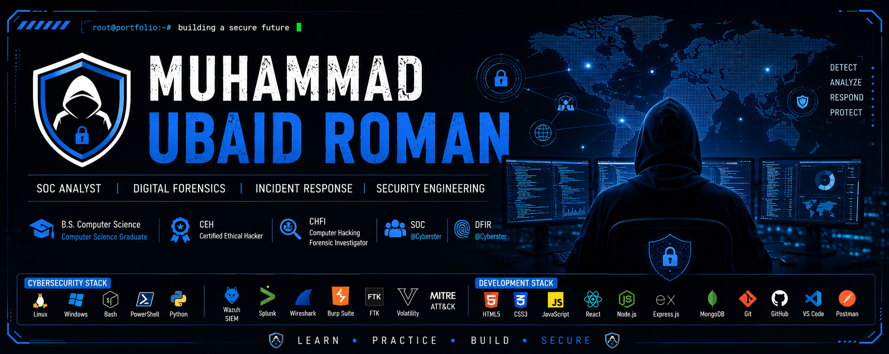

  

<h1 align="center">Hi 👋, I'm Muhammad Ubaid Roman</h1>

<h3 align="center">
SOC Analyst • Digital Forensics • Incident Response • Security Engineering
</h3>

BS Computer Science Graduate | CEH & CHFI Certified | Passionate about Blue Team Operations and Security Engineering

---

# 👨‍💻 About Me

Computer Science Graduate | CEH & CHFI Certified | Building Practical Cybersecurity Skills through SOC, DFIR, and Security Engineering

I enjoy building enterprise-style security labs, investigating cyber incidents, analyzing digital evidence, and documenting technical investigations using industry-standard methodologies.

Alongside cybersecurity, I also develop secure full-stack web applications using the **MERN Stack**, enabling me to understand both application development and application security.

---

## 🎯 Current Focus

- 🔐 Preparing for SOC Analyst & Security Engineer roles
- 🧪 Practicing Digital Forensics & Incident Response
- 🛡️ Building practical Blue Team security labs
- 🤖 Developing an AI Voice Receptionist SaaS
- ☁️ Expanding knowledge in Cloud & Security Engineering

---

---

# 🏅 Certifications

- 🛡️ Certified Ethical Hacker (CEH) — EC-Council
- 🔍 Computer Hacking Forensic Investigator (CHFI) — EC-Council
- 🎓 B.S. Computer Science Graduate
- 💼 Security Operations Center (SOC) Internship — Cyberster
- 🧪 Digital Forensics & Incident Response (DFIR) Internship — Cyberster

---

# 🚀 Featured Cybersecurity Projects

## 🔐 SOC Labs

Enterprise-style Security Operations Center portfolio documenting six weeks of hands-on Blue Team operations, including SIEM deployment, threat detection, log analysis, threat hunting, incident response, and technical documentation.

---

## 🧪 DFIR Labs

Digital Forensics & Incident Response portfolio documenting six weeks of forensic investigations covering Windows artifacts, Registry analysis, memory forensics, timeline reconstruction, evidence correlation, and professional investigation reporting.

---

# 💻 Featured Development Projects

## 🤖 Phoenix AI Voice Receptionist *(In Progress)*

AI-powered voice receptionist designed for small businesses featuring voice automation, appointment scheduling, CRM integration, Twilio messaging, WhatsApp notifications, and workflow automation using Make.com and Cal.com.

---

## 🎓 SkillForge Learning Management System

A full-featured MERN Learning Management System featuring Admin, Instructor, and Student portals with JWT authentication, role-based authorization, course management, and enrollment tracking.

---

# 🛠️ Tech Stack

## 🔐 Cybersecurity

### Operating Systems

### Programming & Scripting

### Security Tools

### Security Concepts

---

# 💻 Full Stack Development

### Languages

### Frontend

### Backend

### Database

### Development Tools

---

## 🔥 Core Skills

**Cybersecurity**

- Security Operations Center (SOC)
- Digital Forensics & Incident Response (DFIR)
- Threat Detection
- Incident Response
- Threat Hunting
- Log Analysis
- Vulnerability Assessment
- Windows Forensics
- Memory Forensics
- Network Security
- SIEM
- MITRE ATT&CK

**Development**

- MERN Stack
- REST APIs
- JWT Authentication
- Role-Based Access Control (RBAC)
- MongoDB
- React.js
- Node.js
- Express.js
- Git & GitHub

---

# 🏆 Professional Highlights

✅ 12 Weeks of Hands-on Cybersecurity Internship

✅ SOC & DFIR Portfolio Projects

✅ CEH & CHFI Certified

✅ Full Stack MERN Developer

✅ AI Voice Receptionist SaaS

✅ Passionate about Blue Team Operations

---

# 📈 GitHub Statistics

---

# 🌱 Currently Learning

- ☁️ Cloud Security (AWS)
- 🛡️ Detection Engineering
- 📊 Threat Hunting
- ⚙️ Security Automation
- 🤖 AI for Cybersecurity
- 🔐 Secure Software Development

---

# 🤝 Let's Connect

---

## 💡 Philosophy

> **"Security is not about knowing every attack. It's about continuously learning, adapting, and building systems that can withstand them."**

---

⭐ **If you like my work, consider giving a Star to my repositories.**

Thanks for visiting my profile! 👋

